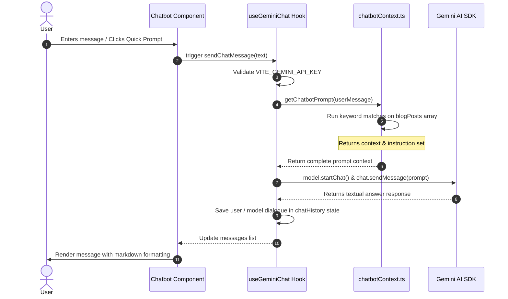
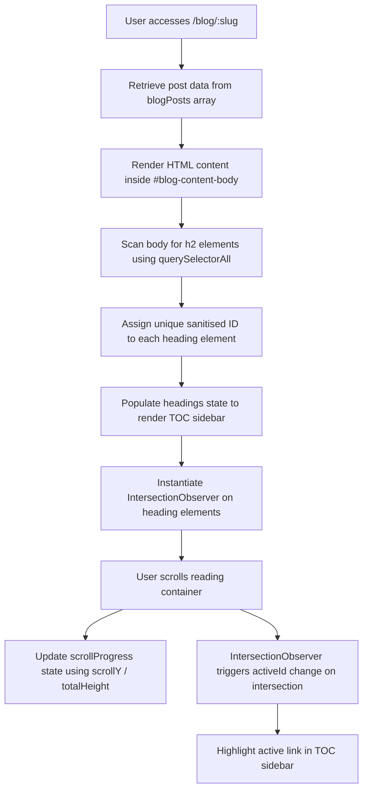
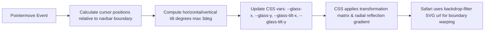

# Project Brain: Single Source of Truth

Welcome to the **Developer Brain** of the Rafiq Portfolio project. This document serves as the absolute, single source of truth (SSOT) for the architecture, data models, workflows, styling rules, deployment configurations, and code relationships of this system. It is designed to allow any developer or AI coding agent to immediately understand, debug, test, maintain, and extend this codebase.

---

## 1. System Architecture & Component Mapping

The portfolio is architected as a high-performance **Single Page Application (SPA)** using **React Router v7** and compiled using **Vite**. The runtime operates completely client-side in production.

```
[User Browser]
      │
      ├─── (Renders Static Build Served by Vercel or `serve`)
      │
      ├─── Liquid Glass Navbar (Dynamic coordinates via hook)
      │
      ├─── AI Chatbot (Client-side request directly to Gemini API)
      │
      └─── Contact Form (Dispatches request to Formspree Endpoint)
```

### Directory Architecture

```
portfolio/
├── .github/                   # CI/CD configurations (GitHub Actions)
├── app/                       # Core Application Source Code
│   ├── +types/                # Autogenerated React Router type overrides
│   ├── assets/                # Local static images, fonts, and assets
│   ├── components/            # UI components grouped by tier
│   │   ├── feedback/          # Interactive loaders, 404s, and error boundary elements
│   │   ├── layout/            # Scaffolding: Section shells, Container, and Navbar
│   │   ├── sections/          # Content blocks (Hero, About, Projects, Experience, Education, Contact)
│   │   └── ui/                # Small reusable design primitives (Badge, Button, Card, Modal, Chatbot)
│   ├── data/                  # Static content files serving as a client-side database
│   │   └── posts/             # Content files for blog posts containing raw body layouts
│   ├── hooks/                 # Custom React hooks (cursor-tracking, physics, events)
│   ├── lib/                   # Utility scripts, constant structures, and AI models
│   ├── routes/                # Route components mapped to URL patterns
│   ├── types/                 # Custom TypeScript definitions for data structures
│   ├── app.css                # Global styles, Tailwind v4 imports, and design token config
│   ├── root.tsx               # App shell, main HTML document layout, and error boundaries
│   └── routes.ts              # React Router central routing table
├── public/                    # Root-level static asset directory (robots, sitemap, thumbnails)
├── Dockerfile                 # Multi-stage secure build configuration
├── react-router.config.ts     # Main React Router central config (SPA-mode toggle)
├── tsconfig.json              # TypeScript compiler paths and rules
├── vercel.json                # Vercel deployment rewrite routes and configurations
└── vite.config.ts             # Vite build setup, plugin mapping, and dev server configurations
```

---

## 2. Core Modules & Component Analysis

This table reverse-engineers the codebase's main files, clarifying their responsibilities, dependencies, and risks of modifications:

| File Path | Component Tier / Type | Responsibility & Purpose | Key Dependencies | What Could Break if Modified |
| :--- | :--- | :--- | :--- | :--- |
| [`app/routes.ts`](file:///Users/muhammadrafiq/Desktop/Self%20Projects/Portfolio/portfolio/app/routes.ts) | Routing Configuration | Central routing table. Maps `/` to Home, `/blog` to Blog list, and `/blog/:slug` to Blog detail. | `@react-router/dev/routes` | Modifying links here without updating router-specific hooks or links throughout sections will result in client 404 page routing. |
| [`app/root.tsx`](file:///Users/muhammadrafiq/Desktop/Self%20Projects/Portfolio/portfolio/app/root.tsx) | Application Shell | Renders main `<html>` scaffolding, imports global styles, injects SEO meta headers, links fonts, and loads the SVG refraction overlay. Defines the root error boundary. | `react-router`, [`GlassDistortion`](file:///Users/muhammadrafiq/Desktop/Self%20Projects/Portfolio/portfolio/app/components/GlassDistortion.tsx), [`LoadingScreen`](file:///Users/muhammadrafiq/Desktop/Self%20Projects/Portfolio/portfolio/app/components/feedback/LoadingScreen.tsx) | Disabling font sheets here degrades layout rendering. Removing the refraction filter breaks the navbar edge distortion in Safari. |
| [`app/components/layout/Navbar.tsx`](file:///Users/muhammadrafiq/Desktop/Self%20Projects/Portfolio/portfolio/app/components/layout/Navbar.tsx) | Layout Scaffolder | Renders the bottom "Liquid Glass" navigation dock. Detects page scroll states to show/hide and handles dynamic path highlighting for sections. | [`useGlassCursor`](file:///Users/muhammadrafiq/Desktop/Self%20Projects/Portfolio/portfolio/app/hooks/useGlassCursor.ts), `react-router` | Altering the `NAV_ITEMS` array without checking hash matches breaks active status calculations on the homepage. |
| [`app/hooks/useGlassCursor.ts`](file:///Users/muhammadrafiq/Desktop/Self%20Projects/Portfolio/portfolio/app/hooks/useGlassCursor.ts) | System Hook | Tracks mouse coordinates over a referenced element, calculates 3D rotation, and updates CSS custom variables for glass rendering. | `useEffect`, `useRef`, window events | Removing the `requestAnimationFrame` throttle introduces cursor tracking latency and drops framerates during hover. |
| [`app/components/GlassDistortion.tsx`](file:///Users/muhammadrafiq/Desktop/Self%20Projects/Portfolio/portfolio/app/components/GlassDistortion.tsx) | Layout Primitive | Houses the inline SVG refraction filter that bends passing light along the border of the navbar pill. | Raw SVG Filter tags (`feGaussianBlur`, `feDisplacementMap`, `feComposite`) | Changing the `id` from `liquid-glass-distort` breaks the background-bend fallback mechanism in the CSS. |
| [`app/components/ui/Chatbot.tsx`](file:///Users/muhammadrafiq/Desktop/Self%20Projects/Portfolio/portfolio/app/components/ui/Chatbot.tsx) | UI Component | Sidebar chat card interface. Renders query history, displays active typing states, formats responses, and houses quick action buttons. | [`useGeminiChat`](file:///Users/muhammadrafiq/Desktop/Self%20Projects/Portfolio/portfolio/app/lib/useGeminiChat.ts), [`chatbotContext`](file:///Users/muhammadrafiq/Desktop/Self%20Projects/Portfolio/portfolio/app/data/chatbotContext.ts) | Replacing markdown parsing regex will break rendering of bullets and headers in the assistant replies. |
| [`app/lib/useGeminiChat.ts`](file:///Users/muhammadrafiq/Desktop/Self%20Projects/Portfolio/portfolio/app/lib/useGeminiChat.ts) | Core Utility | Manages state, chat history array, API keys, loading indicator state, and dispatches prompts directly to the Gemini API SDK. | `@google/generative-ai`, [`chatbotContext`](file:///Users/muhammadrafiq/Desktop/Self%20Projects/Portfolio/portfolio/app/data/chatbotContext.ts) | Removing environment variables validation will lead to silent app failures for users if the key configuration is missing. |
| [`app/routes/api.chat.tsx`](file:///Users/muhammadrafiq/Desktop/Self%20Projects/Portfolio/portfolio/app/routes/api.chat.tsx) | Orphan Route (Server) | An unused / unregistered API route intended to act as a backend route for processing AI prompts. Runs server-side. | [`geminiAI.server`](file:///Users/muhammadrafiq/Desktop/Self%20Projects/Portfolio/portfolio/app/lib/geminiAI.server.ts) | Currently unused because the app builds as a static SPA. This is technical debt. |
| [`app/routes/blog-detail.tsx`](file:///Users/muhammadrafiq/Desktop/Self%20Projects/Portfolio/portfolio/app/routes/blog-detail.tsx) | Dynamic Route | Renders detail views for individual posts. Calculates scroll reading percentages, builds TOCs via IntersectionObserver, and suggests related articles. | [`blogPosts`](file:///Users/muhammadrafiq/Desktop/Self%20Projects/Portfolio/portfolio/app/data/blog.ts), `react-router` | Modifying how `h2` headers are selected will break the Table of Contents rendering. |
| [`app/data/chatbotContext.ts`](file:///Users/muhammadrafiq/Desktop/Self%20Projects/Portfolio/portfolio/app/data/chatbotContext.ts) | Content Layer | Contains prompt templates and keyword scoring algorithms. Dynamically fetches relevant blog posts matching the user query to inject as context. | [`blogPosts`](file:///Users/muhammadrafiq/Desktop/Self%20Projects/Portfolio/portfolio/app/data/blog.ts) | Messing up the scoring threshold will prevent the chatbot from pulling correct blog context for user questions. |
| [`app/components/sections/ContactSection.tsx`](file:///Users/muhammadrafiq/Desktop/Self%20Projects/Portfolio/portfolio/app/components/sections/ContactSection.tsx) | Content Section | Renders the project contact form and hosts the `Chatbot` component. Handles API transmission status. | `@formspree/react`, [`Chatbot`](file:///Users/muhammadrafiq/Desktop/Self%20Projects/Portfolio/portfolio/app/components/ui/Chatbot.tsx) | Changing the Formspree ID ("mbdqoqay") will disrupt form submissions and prevent contact emails from delivering. |

---

## 3. Core Workflows & Data Flows

### A. The AI Chatbot Lifecycle


### B. Dynamic Table of Contents (TOC) & Scroll Tracking in Blog Detail


### C. Liquid Glass Navigation Dynamics


---

## 4. UI System & Design Tokens

### The Dark Mode Styling Architecture
The portfolio utilizes a sleek, dark-themed custom CSS variables palette, which is integrated with Tailwind CSS v4 in `app/app.css`.

> [!WARNING]
> There is a styling mismatch: the file `colors-and-typography.md` documents a "Warm Light Mode" system (featuring beige surfaces like `#F3F0EA`). However, the actual application implemented in `app/app.css` uses a **Dark Mode** system (featuring `#0B0C10` and `#14161C`). Developers must refer to `app.css` as the ultimate styling authority.

### Style Variables Configuration (Source of Truth)
```css
:root {
  color-scheme: dark;

  /* Typography Scales */
  --font-heading: "Playfair Display", serif;
  --font-body: "Inter", sans-serif;
  --font-mono: "JetBrains Mono", monospace;

  /* Background Canvas */
  --bg-page: #0B0C10;              /* Deep background canvas space */
  --bg-surface: #14161C;           /* Flat resting container backgrounds */
  --bg-surface-hover: #1D1F27;     /* Hover surface colors */

  /* Hairlines and Borders */
  --border-default: rgba(255, 255, 255, 0.08);
  --border-hover: rgba(255, 255, 255, 0.16);

  /* Contrast Text Tiers */
  --text-primary: #F3F4F6;         /* Clear white titles & headers */
  --text-secondary: #9CA3AF;       /* Muted light gray body copy */
  --text-muted: #6B7280;           /* Heavy gray labels & dates */

  /* Royal Blue Accent Scale */
  --accent-50: rgba(59, 130, 246, 0.1);
  --accent-100: rgba(59, 130, 246, 0.2);
  --accent-600: #3B82F6;           /* Core action button color */
  --accent-700: #60A5FA;           /* Text link blue */
  --accent-800: #93C5FD;           /* Pressed highlight */
}
```

### Glassmorphism Utility Primitives (`app.css`)
*   **`.glass-panel`**: Backed by `rgba(20, 22, 28, 0.45)`, `backdrop-filter: blur(16px)`, a fine white border (`rgba(255, 255, 255, 0.08)`), and an inner highlight shadow. Used as the main wrapper template for sections and layout tiles.
*   **`.glass-panel-hover`**: Adds transition animations that translate the card up (`translateY(-2px)`) and transition borders to the accent blue color (`rgba(59, 130, 246, 0.25)`).
*   **`.glass-panel-inset`**: Dark background recessed card styling (`rgba(13, 14, 18, 0.45)`) with an inner drop-shadow. Used in code containers and search inputs.

---

## 5. Deployment, Environment & Operational Behavior

### A. SPA Build vs. Runtime Execution
The project runs in **Single Page Application (SPA) mode** because `ssr: false` is configured in `react-router.config.ts`. 

> [!IMPORTANT]
> Because the application is a static SPA, **runtime environment variables are not available**. Any variable starting with `VITE_` must be present **at build-time**, otherwise it will compile as `undefined` in the output bundles.

```
Build Time (Injects VITE_ env vars) ──> Static Compilation (Outputs build/client) ──> Static Hosting (Vercel/serve)
```

### B. Environment Variables Schema
| Name | Scope / Target | Description | Safe in Client Bundle? |
| :--- | :--- | :--- | :---: |
| `VITE_GEMINI_API_KEY` | Client-Side Chatbot | Authorizes connection to Gemini API endpoints. | **No** (Visible in compiled Javascript) |
| `VITE_GEMINI_MODEL` | Client-Side Chatbot | Specifies which LLM version to use (Defaults to `gemini-2.5-flash`). | Yes |
| `VITE_FORMSPREE_ID` | Form Submissions | Identifies target recipient mailbox in Formspree. | Yes (Hardcoded to `"mbdqoqay"`) |

### C. Production Server Setup (`serve`)
In a containerized environment (or locally using `npm run start`), the built site is served using `serve` pointing to `build/client`. 
*   **Routing Fallback**: Deep links (like entering the browser search bar at `/blog`) require routing fallbacks to the index file, which is resolved via Vercel rewrites or the `-s` flag in the `serve` command.

### D. Docker Strategy
The multi-stage `Dockerfile` handles building the static bundle in a secure environment:
1.  **Dependencies stages (`dev-deps` and `prod-deps`)**: Optimizes builds by installing dev dependencies separately from runtime dependencies.
2.  **`builder` Stage**: Accepts build arguments (`ARG VITE_GEMINI_API_KEY` etc.) and writes them as environment variables during `npm run build` so they are successfully compiled into the client bundle.
3.  **`runner` Stage**: Uses Node alpine, strips out source development files, sets the environment to production, switches context to the standard `node` user for security, and starts serving the static site.

---

## 6. Known Technical Debt, Risks & Constraints

1.  **Exposed API Keys in Client Bundle**:
    *   **Risk**: Because the application compiles as a static client-side bundle and queries the Gemini API directly from `useGeminiChat.ts` via the browser, the `VITE_GEMINI_API_KEY` is fully readable by inspect-source actions in production.
    *   **Remediation**: Transition the app to SSR mode, or write a server route handler that proxies chatbot requests to Gemini, keeping the API key hidden on the server.
2.  **Unregistered Orphan Route**:
    *   `app/routes/api.chat.tsx` and `app/lib/geminiAI.server.ts` exist but are completely disconnected from `app/routes.ts`. 
    *   **Risk**: Dead code path that increases bundle overhead and creates confusion.
    *   **Remediation**: Delete these server files, or register and utilize them once server hosting capabilities are introduced.
3.  **Documentation Style Discrepancy**:
    *   `colors-and-typography.md` outlines design rules for a Warm Light Mode theme. The active system in `app.css` enforces a Dark Mode theme.
    *   **Risk**: High developer confusion when reference guides mismatch live styles.
    *   **Remediation**: Update `colors-and-typography.md` to reflect the active dark variables.
4.  **Direct DOM Mutation in React**:
    *   `blog-detail.tsx` relies on direct DOM scans (`document.getElementById`, `container.querySelectorAll("h2")`) and DOM injections (`document.createElement("button")`) to construct table of contents IDs and copy buttons.
    *   **Risk**: Bypassing React's virtual DOM structure can cause race conditions or styling flashes during page hydration transitions.
    *   **Remediation**: Utilize a specialized markdown parser library (like `react-markdown` or custom components) to render structured content elements natively.
