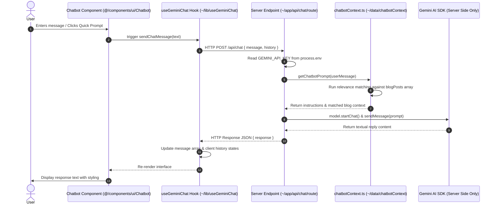
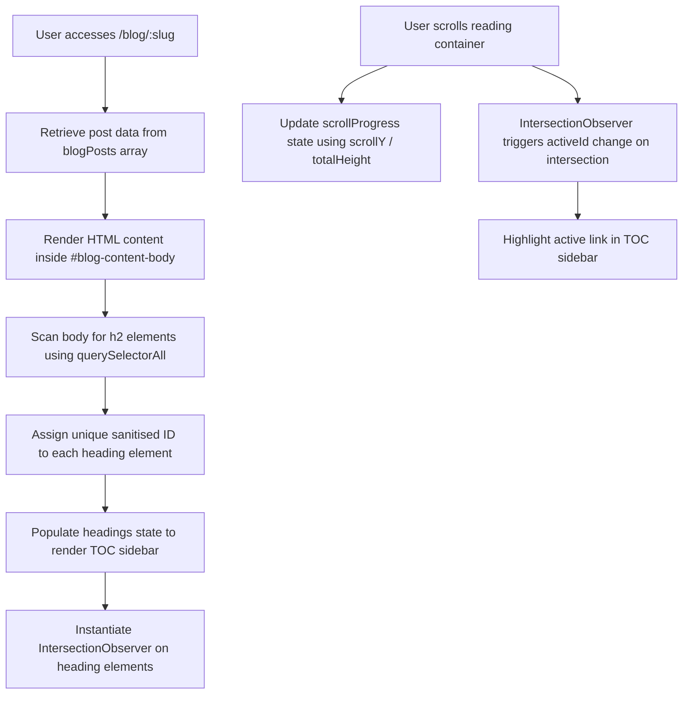

# Developer Brain

Welcome to the **Developer Brain** of the Rafiq Portfolio project. This document serves as the absolute, single source of truth (SSOT) for the architecture, data models, workflows, styling rules, deployment configurations, and code relationships of this system. It is designed to allow any developer or AI coding agent to immediately understand, debug, test, maintain, and extend this codebase.

---

## 1. System Architecture & Component Mapping

The portfolio is architected as a modern web application using **Next.js 16 (App Router)** and **React 19**. While the frontend sections render and execute client-side, the backend operations run server-side using Next.js Route Handlers.

```
[User Browser (Client)]
       │
       ├─── (Renders Next.js static and dynamic pages)
       │
       ├─── Liquid Glass Navbar (Dynamic coordinates tracking via custom hook)
       │
       ├─── Contact Form (Dispatches requests to Formspree Endpoint)
       │
       └─── AI Chatbot ──> [HTTP POST /api/chat] ──> [Next.js Route Handler (Server)]
                                                            │
                                                            └─── (Gemini API Endpoint securely authorized)
```

### Directory Architecture

```
portfolio/
├── .github/                   # CI/CD configurations (GitHub Actions)
├── components/                # Shared UI Components (Root Level)
│   ├── feedback/              # Interactive loaders, 404 views, and fallbacks
│   ├── layout/                # Section wrappers, Container grid, and Navbar
│   ├── sections/              # HomePage blocks (Hero, About, Projects, Experience, Contact)
│   └── ui/                    # Reusable primitives (Badge, Button, Card, Modal, Chatbot, AppleIcons)
├── app/                       # Next.js App Router (Routing and Server Logic)
│   ├── api/                   # Server API route endpoints
│   │   └── chat/              # Route handler for proxying Gemini requests (/api/chat)
│   ├── blog/                  # Blog layouts and individual post slug directories
│   ├── prompts/               # AI prompts repository layouts
│   ├── data/                  # Static content files serving as a client-side database
│   ├── hooks/                 # Custom React hooks (cursor-tracking, reading scroll, physics)
│   ├── lib/                   # Utility helpers, constants, and AI API libraries
│   ├── types/                 # Custom TypeScript definitions and contracts
│   ├── globals.css            # Global Tailwind v4 styles and design token configs
│   ├── layout.tsx             # Main HTML document layout and root provider wrappers
│   ├── page.tsx               # Index home entry point (renders homepage layout)
│   └── not-found.tsx          # 404 page handler
├── public/                    # Root-level static assets (robots, sitemap, thumbnails)
├── Dockerfile                 # Multi-stage secure build configuration
├── next.config.ts             # Next.js compiler and build configuration
├── tsconfig.json              # TypeScript path aliases and compiler configurations
├── package.json               # System dependencies and build run-scripts
└── vercel.json                # Vercel deployment rewrite rules
```

---

## 2. Core Modules & Component Analysis

This table reverse-engineers the codebase's main files, clarifying their responsibilities, dependencies, and risks of modifications:

| File Path | Component Tier / Type | Responsibility & Purpose | Key Dependencies | What Could Break if Modified |
| :--- | :--- | :--- | :--- | :--- |
| [`app/layout.tsx`](file:///Users/muhammadrafiq/Desktop/Self%20Projects/Personal%20Portfolio/app/layout.tsx) | Root Layout | Injects default html and body shells, imports Google Fonts, loads `@/components/GlassDistortion`, sets SEO titles/meta, and wraps global providers. | `next/font/google`, `globals.css` | Changing page layouts here breaks CSS grid dimensions, fonts, and root styling rules. |
| [`components/layout/Navbar.tsx`](file:///Users/muhammadrafiq/Desktop/Self%20Projects/Personal%20Portfolio/components/layout/Navbar.tsx) | Layout Scaffolder | Renders the bottom "Liquid Glass" navigation dock. Tracks scroll positions, highlighting active section hashes on viewport entries. | `useGlassCursor`, `next/navigation`, `AppleIcons` | Modifying links or section names breaks hover animations and scroll highlight coordinates. |
| [`app/hooks/useGlassCursor.ts`](file:///Users/muhammadrafiq/Desktop/Self%20Projects/Personal%20Portfolio/app/hooks/useGlassCursor.ts) | System Hook | Tracks mouse coordinates over a referenced element, calculates 3D rotation, and updates CSS custom variables for glass rendering. | React lifecycle hooks, window events | Removing boundary checking introduces latency and drops frame render rates. |
| [`components/GlassDistortion.tsx`](file:///Users/muhammadrafiq/Desktop/Self%20Projects/Personal%20Portfolio/components/GlassDistortion.tsx) | Layout Primitive | Houses the inline SVG refraction filter that bends passing light along the border of the navbar pill. | SVG Filter tags (`feGaussianBlur`, `feDisplacementMap`) | Modifying filter IDs breaks glass refraction fallbacks in webkits like Safari. |
| [`components/ui/Chatbot.tsx`](file:///Users/muhammadrafiq/Desktop/Self%20Projects/Personal%20Portfolio/components/ui/Chatbot.tsx) | UI Component | Renders the chatbot assistant sidebar interface, typing statuses, response formats, and quick prompts. | `useGeminiChat`, `AppleIcons` | Breaking markup logic impacts markdown translation for incoming messages. |
| [`app/lib/useGeminiChat.ts`](file:///Users/muhammadrafiq/Desktop/Self%20Projects/Personal%20Portfolio/app/lib/useGeminiChat.ts) | Hook (Client) | Orchestrates user-prompt input state and chat message arrays. Proxies message packets to `/api/chat` securely. | `fetch`, React state hooks | Breaking client fetch payloads results in silent error codes on user interface displays. |
| [`app/api/chat/route.ts`](file:///Users/muhammadrafiq/Desktop/Self%20Projects/Personal%20Portfolio/app/api/chat/route.ts) | API Endpoint (Server) | Reads incoming user prompts, calls `chatbotContext` to compile context queries, initializes Gemini, and secures API keys server-side. | `@google/generative-ai`, `chatbotContext` | Removing `process.env` lookups causes runtime 500 crashes since the client does not store keys. |
| [`app/data/chatbotContext.ts`](file:///Users/muhammadrafiq/Desktop/Self%20Projects/Personal%20Portfolio/app/data/chatbotContext.ts) | Context Layer | Contains prompt templates and keyword scoring algorithms. Dynamically fetches relevant blog posts matching the user query to inject as context. | `blogPosts` | Modifying relevance weights blocks accurate blog matching context in answers. |
| [`components/sections/ContactSection.tsx`](file:///Users/muhammadrafiq/Desktop/Self%20Projects/Personal%20Portfolio/components/sections/ContactSection.tsx) | Content Section | Hosts client contact email form utilizing Formspree, and mounts the AI Chatbot helper card. | `@formspree/react`, `Chatbot` | Altering Formspree targets breaks mailbox submissions and email forwarding. |

---

## 3. Core Workflows & Data Flows

### A. The Secure AI Chatbot Lifecycle


### B. Dynamic Table of Contents (TOC) & Scroll Tracking in Blog Detail


---

## 4. UI System & Design Tokens

### The Dark Mode Styling Architecture
The portfolio utilizes a sleek, dark-themed custom CSS variables palette, which is integrated with Tailwind CSS v4 in `app/globals.css`.

### Style Variables Configuration (Source of Truth)
```css
:root {
  color-scheme: dark;

  /* Typography Scales */
  --font-heading: "Playfair Display", serif;
  --font-body: "Inter", sans-serif;
  --font-mono: "JetBrains Mono", monospace;

  /* Background Canvas */
  --bg-page: #0B0C10;              /* Deep background canvas space */
  --bg-surface: #14161C;           /* Flat resting container backgrounds */
  --bg-surface-hover: #1D1F27;     /* Hover surface colors */

  /* Hairlines and Borders */
  --border-default: rgba(255, 255, 255, 0.08);
  --border-hover: rgba(255, 255, 255, 0.16);

  /* Contrast Text Tiers */
  --text-primary: #F3F4F6;         /* Clear white titles & headers */
  --text-secondary: #9CA3AF;       /* Muted light gray body copy */
  --text-muted: #6B7280;           /* Heavy gray labels & dates */

  /* Royal Blue Accent Scale */
  --accent-50: rgba(59, 130, 246, 0.1);
  --accent-100: rgba(59, 130, 246, 0.2);
  --accent-600: #3B82F6;           /* Core action button color */
  --accent-700: #60A5FA;           /* Text link blue */
  --accent-800: #93C5FD;           /* Pressed highlight */
}
```

### Glassmorphism Utility Primitives (`globals.css`)
*   **`.glass-panel`**: Backed by `rgba(20, 22, 28, 0.45)`, `backdrop-filter: blur(16px)`, a fine white border (`rgba(255, 255, 255, 0.08)`), and an inner highlight shadow. Used as the main wrapper template for sections and layout tiles.
*   **`.glass-panel-hover`**: Adds transition animations that translate the card up (`translateY(-2px)`) and transition borders to the accent blue color (`rgba(59, 130, 246, 0.25)`).
*   **`.glass-panel-inset`**: Dark background recessed card styling (`rgba(13, 14, 18, 0.45)`) with an inner drop-shadow. Used in code containers and search inputs.

---

## 5. Deployment, Environment & Operational Behavior

### A. Next.js App Router Execution
The project is built on **Next.js 16**, compiling pages to static files where possible (SSG/ISR) and maintaining dynamic runtime server-side execution for API routes (such as `/api/chat`).

### B. Environment Variables Schema
| Name | Scope / Target | Description | Safe in Client Bundle? |
| :--- | :--- | :--- | :---: |
| `GEMINI_API_KEY` | Server-Side Chatbot Route | Authorizes server-side connection to Gemini API endpoints. | **No** (Kept safe on server) |
| `GEMINI_MODEL` | Server-Side Chatbot Route | Specifies which LLM version to use (Defaults to `gemini-2.5-flash`). | **No** (Kept safe on server) |
| `VITE_FORMSPREE_ID` | Form Submissions | Identifies target recipient mailbox in Formspree. | Yes (Hardcoded to `"mbdqoqay"`) |

---

## 6. Known Technical Debt, Risks & Constraints

1.  **Direct DOM Mutation in React**:
    *   `BlogDetailClient.tsx` relies on direct DOM scans (`document.getElementById`, `container.querySelectorAll("h2")`) and DOM injections (`document.createElement("button")`) to construct table of contents IDs and copy buttons.
    *   **Risk**: Bypassing React's virtual DOM structure can cause race conditions or styling flashes during page transitions.
    *   **Remediation**: Utilize a specialized markdown parser library (like `react-markdown` or custom components) to render structured content elements natively.
2.  **Unused Server Helper**:
    *   `app/lib/geminiAI.server.ts` exists but is completely bypassed by `app/api/chat/route.ts` which instantiates and models Gemini queries internally.
    *   **Risk**: Unused code logic that causes developer confusion.
    *   **Remediation**: Delete `geminiAI.server.ts` or refactor the route handler to delegate work to it.